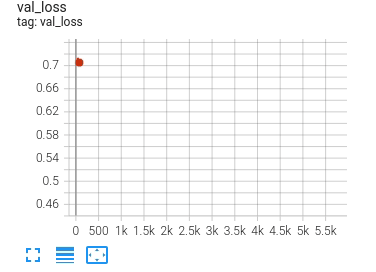

.. testsetup:: *

    from pytorch_lightning.trainer.trainer import Trainer
    from pytorch_lightning.callbacks.finetuning_scheduler.fts import FinetuningScheduler

.. _finetuning_scheduler:

********************
Finetuning Scheduler
********************
Training with the :class:`~pytorch_lightning.callbacks.finetuning_scheduler.fts.FinetuningScheduler` callback confers
a host of benefits. It was created to meet the following objectives in roughly descending order of priority:

* maximize finetuning flexibility
* expedite and facilitate exploration of model tuning dynamics in research
* allow marginal performance improvements of finetuned models

Fundamentally, the :class:`~pytorch_lightning.callbacks.finetuning_scheduler.fts.FinetuningScheduler` callback enables multi-phase,
scheduled finetuning of foundational models. Gradual unfreezing (i.e. thawing) can help maximize foundational model
knowledge retention while allowing (typically upper layers of) the model to optimally adapt to new tasks during
transfer learning [#]_ [#]_ [#]_ .

:class:`~pytorch_lightning.callbacks.finetuning_scheduler.fts.FinetuningScheduler` orchestrates the gradual unfreezing
of models via a finetuning schedule that is either implicitly generated (the default) or explicitly provided by the user
(more computationally efficient). Finetuning phase transitions are driven by
:class:`~pytorch_lightning.callbacks.finetuning_scheduler.fts_supporters.FTSEarlyStopping` criteria (a multi-phase
extension of :class:`~pytorch_lightning.callbacks.early_stopping.EarlyStopping`), user-specified epoch transitions
or a composition of the two (the default mode). A
:class:`~pytorch_lightning.callbacks.finetuning_scheduler.fts.FinetuningScheduler` training session completes when the
final phase of the schedule has its stopping criteria met. See
:ref:`Early Stopping<common/early_stopping:Early stopping>` for more details on that callback's configuration.

.. warning:: The :class:`~pytorch_lightning.callbacks.finetuning_scheduler.fts.FinetuningScheduler` callback is in beta
    and subject to change.

Basic Usage
=============
If no finetuning schedule is user-provided,
:class:`~pytorch_lightning.callbacks.finetuning_scheduler.fts.FinetuningScheduler` will generate a
:ref:`default schedule<advanced/finetuning_scheduler:The Default Finetuning Schedule>` and proceed to finetune
according to the generated schedule, using default
:class:`~pytorch_lightning.callbacks.finetuning_scheduler.fts_supporters.FTSEarlyStopping`
and :class:`~pytorch_lightning.callbacks.finetuning_scheduler.fts_supporters.FTSCheckpoint` callbacks with
``monitor=val_loss``.

.. code-block:: python

    from pytorch_lightning import Trainer
    from pytorch_lightning.callbacks.finetuning_scheduler import FinetuningScheduler

    trainer = Trainer(callbacks=[FinetuningScheduler()])

.. _default schedule:

The Default Finetuning Schedule
===============================
Schedule definition is facilitated via
:meth:`~pytorch_lightning.callbacks.finetuning_scheduler.fts_supporters.SchedulingMixin.gen_ft_schedule` which dumps
a default finetuning schedule (by default using a naive, 2-parameters per level heuristic) which can be adjusted as
desired by the user and/or subsequently passed to the callback. Using the default/implicitly generated schedule will
often be less computationally efficient than a user-defined finetuning schedule but can often serve as a
good baseline for subsquent explicit schedule refinement and will marginally outperform many explicit schedules.

.. _specifying schedule:

Specifying a Finetuning Schedule
================================

To specify a finetuning schedule, it's convenient to first generate the default schedule and then alter the
thawed/unfrozen parameter groups associated with each finetuning phase as desired. Finetuning phases are zero-indexed
and executed in ascending order.

1. Generate the default schedule to :paramref:`~pytorch_lightning.trainer.trainer.Trainer.log_dir` with the name
   (:paramref:`~pytorch_lightning.trainer.trainer.lightning_module`.__class__.__name__)_ft_schedule.yaml

.. code-block:: python

    from pytorch_lightning import Trainer
    from pytorch_lightning.callbacks.finetuning_scheduler import FinetuningScheduler

    trainer = Trainer(callbacks=[FinetuningScheduler(gen_ft_sched_only=True)])

2. Alter the schedule as desired.

.. container:: sbs-code

    .. rst-class:: sbs-hdr1

        Changing the generated schedule for this boring model...

    .. rst-class:: sbs-blk1

    .. code-block:: yaml
      :linenos:

        0:
            params:
            - layer.3.bias
            - layer.3.weight
        1:
            params:
            - layer.2.bias
            - layer.2.weight
        2:
            params:
            - layer.1.bias
            - layer.1.weight
        3:
            params:
            - layer.0.bias
            - layer.0.weight

    .. rst-class:: sbs-hdr2

        ... to have three finetuning phases instead of four:

    .. rst-class:: sbs-blk2

    .. code-block:: yaml
      :linenos:

        0:
            params:
            - layer.3.bias
            - layer.3.weight
        1:
            params:
            - layer.2.*
            - layer.1.bias
            - layer.1.weight
        2:
            params:
            - layer.0.*

3. Once the finetuning schedule has been altered as desired, pass it to
   :class:`~pytorch_lightning.callbacks.finetuning_scheduler.fts.FinetuningScheduler` to commence scheduled training:

.. code-block:: python

    from pytorch_lightning import Trainer
    from pytorch_lightning.callbacks.finetuning_scheduler import FinetuningScheduler

    trainer = Trainer(callbacks=[FinetuningScheduler(ft_schedule="/path/to/my/schedule/my_schedule.yaml")])

EarlyStopping and Epoch-Driven Phase Transition Criteria
========================================================

By default, :class:`~pytorch_lightning.callbacks.finetuning_scheduler.fts_supporters.FTSEarlyStopping` and epoch-driven
transition criteria are composed. If a ``max_transition_epoch`` is specified for a given phase, the next finetuning
phase will begin at that epoch unless
:class:`~pytorch_lightning.callbacks.finetuning_scheduler.fts_supporters.FTSEarlyStopping` criteria are met first.
If :paramref:`~pytorch_lightning.callbacks.finetuning_scheduler.fts.FinetuningScheduler.epoch_transitions_only` is
``True``, :class:`~pytorch_lightning.callbacks.finetuning_scheduler.fts_supporters.FTSEarlyStopping` will not be used
and transitions will be exclusively epoch-driven.

.. tip::

    Use of regex expressions can be convenient for specifying more complex schedules:

    .. code-block:: yaml
      :linenos:
      :emphasize-lines: 2, 7, 14

       0:
         params: # the parameters for each phase definition can be fully specified
         - model.classifier.bias
         - model.classifier.weight
         max_transition_epoch: 3
       1:
         params: # or specified via a regex
         - model.albert.pooler.*
       2:
         params:
         - model.albert.encoder.*.ffn_output.*
         max_transition_epoch: 9
       3:
         params: # both approaches to parameter specification can be used in the same phase
         - model.albert.encoder.*.(ffn\.|attention|full*).*
         - model.albert.encoder.embedding_hidden_mapping_in.bias
         - model.albert.encoder.embedding_hidden_mapping_in.weight
         - model.albert.embeddings.*

For a practical end-to-end example of using
:class:`~pytorch_lightning.callbacks.finetuning_scheduler.fts.FinetuningScheduler` in implicit versus explicit modes,
see :ref:`scheduled finetuning for SuperGLUE<scheduled-finetuning-superglue>` below or the
`notebook-based tutorial  <https://pytorch-lightning.readthedocs.io/en/latest/notebooks/lightning_examples/text-transformers.html>`_ .

Resuming Scheduled Finetuning Training Sessions
===============================================

Resumption of scheduled finetuning training is identical to the continuation of
:ref:`other training sessions<common/trainer:trainer>` with the caveat that the provided checkpoint must
have been saved by a :class:`~pytorch_lightning.callbacks.finetuning_scheduler.fts.FinetuningScheduler` session.
:class:`~pytorch_lightning.callbacks.finetuning_scheduler.fts.FinetuningScheduler` uses
:class:`~pytorch_lightning.callbacks.finetuning_scheduler.fts_supporters.FTSCheckpoint` (an extension of
:class:`~pytorch_lightning.callbacks.model_checkpoint.ModelCheckpoint`) to maintain schedule state with special
metadata.

.. code-block:: python

    from pytorch_lightning import Trainer
    from pytorch_lightning.callbacks.finetuning_scheduler import FinetuningScheduler

    trainer = Trainer(callbacks=[FinetuningScheduler()], ckpt_path="some/path/to/my_checkpoint.ckpt")

Training will resume at the depth/level of the provided checkpoint according the specified schedule. Schedules can be
altered between training sessions but schedule compatibility is left to the user for maximal flexibility. If executing a
user-defined schedule, typically the same schedule should be provided for the original and resumed training
sessions.

.. tip::

    By default (
    :paramref:`~pytorch_lightning.callbacks.finetuning_scheduler.fts.FinetuningScheduler.restore_best` is ``True``),
    :class:`~pytorch_lightning.callbacks.finetuning_scheduler.fts.FinetuningScheduler` will attempt to restore
    the best available checkpoint before finetuning depth transitions.

    .. code-block:: python

        trainer = Trainer(
            callbacks=[FinetuningScheduler(new_incarnation_mode=True)],
            ckpt_path="some/path/to/my_kth_best_checkpoint.ckpt",
        )

    To handle the edge case wherein one is resuming scheduled finetuning from a non-best checkpoint and the previous
    best checkpoints may not be accessible, setting
    :paramref:`~pytorch_lightning.callbacks.finetuning_scheduler.fts.FinetuningScheduler.new_incarnation_mode` to
    ``True`` as above will re-intialize the checkpoint state with a new best checkpoint at the resumption depth.

Finetuning all the way down!
============================

There are plenty of options for customizing
:class:`~pytorch_lightning.callbacks.finetuning_scheduler.fts.FinetuningScheduler`'s behavior, see
:ref:`scheduled finetuning for SuperGLUE<scheduled-finetuning-superglue>` below for examples of composing different
configurations.

.. note::
   Currently, :class:`~pytorch_lightning.callbacks.finetuning_scheduler.fts.FinetuningScheduler` only supports
   the following :class:`~pytorch_lightning.utilities.enums._StrategyType` s:

   .. hlist::
      :columns: 3

      * :obj:`~pytorch_lightning.utilities.enums._StrategyType.DDP`
      * :obj:`~pytorch_lightning.utilities.enums._StrategyType.DDP_SHARDED`
      * :obj:`~pytorch_lightning.utilities.enums._StrategyType.DDP_SPAWN`
      * :obj:`~pytorch_lightning.utilities.enums._StrategyType.DDP_SHARDED_SPAWN`
      * :obj:`~pytorch_lightning.utilities.enums._StrategyType.DP`

----------

.. _scheduled-finetuning-superglue:

Example: Scheduled Finetuning For SuperGLUE
===========================================

A demonstration of the scheduled finetuning callback
:class:`~pytorch_lightning.callbacks.finetuning_scheduler.fts.FinetuningScheduler` using the
`RTE <https://huggingface.co/datasets/viewer/?dataset=super_glue&config=rte>`_ and
`BoolQ <https://github.com/google-research-datasets/boolean-questions>`_ tasks of the
`SuperGLUE <https://super.gluebenchmark.com/>`_ benchmark and the :ref:`LightningCLI<common/lightning_cli:LightningCLI>`
is available under ./pl_examples/basic_examples/ (depends upon the ``transformers`` and ``datasets`` packages from
Hugging Face and ``sentencepiece`` for the tested model)

There are three different demo schedule configurations composed with shared defaults (./config/fts/fts_defaults.yaml)
provided for the default 'rte' task. Note DDP w/ 2 GPUs is the default configuration so ensure you adjust the
configuration files referenced below as desired for other configurations.

.. code-block:: bash

    # Generate a baseline without scheduled finetuning enabled:
    python fts_superglue.py fit --config config/fts/nofts_baseline.yaml

    # Train with the default finetuning schedule:
    python fts_superglue.py fit --config config/fts/fts_implicit.yaml

    # Train with a non-default finetuning schedule:
    python fts_superglue.py fit --config config/fts/fts_explicit.yaml

All three training scenarios use identical configurations with the exception of the provided finetuning schedule. See
the |tensorboard_summ| and table below for a characterization of the relative computational and performance tradeoffs
associated with these :class:`~pytorch_lightning.callbacks.finetuning_scheduler.fts.FinetuningScheduler` configurations.

:class:`~pytorch_lightning.callbacks.finetuning_scheduler.fts.FinetuningScheduler` expands the space of possible
finetuning schedules and the composition of more sophisticated schedules can yield marginal finetuning performance
gains. That stated, it should be emphasized the primary utility of
:class:`~pytorch_lightning.callbacks.finetuning_scheduler.fts.FinetuningScheduler` is to grant greater finetuning
flexibility for model exploration in research. For example, glancing at DeBERTa-v3's implicit training run, a critical
tuning transition point is immediately apparent:

.. raw:: html

    

        
    

Our val_loss begins a precipitous decline at step 3119 which corresponds to phase 17 in the schedule. Referring to our
schedule, in phase 17 we're beginning tuning the attention parameters of our 10th encoder layer (of 11). Interesting!
Though beyond the scope of this documentation, it might be worth investigating these dynamics further and
:class:`~pytorch_lightning.callbacks.finetuning_scheduler.fts.FinetuningScheduler` allows one to do just that quite
easily.

In addition to the `tensorboard experiment summaries <https://tensorboard.dev/experiment/n7U8XhrzRbmvVzC4SQSpWw/>`_,
full logs/schedules for all three scenarios are available
`here <https://drive.google.com/file/d/1LrUcisRLHeJgh_BDOOD_GUBPp5iHAkoR/view?usp=sharing>`_ and the checkpoints produced
in the scenarios `here <https://drive.google.com/file/d/1t7myBgcqcZ9ax_IT9QVk-vFH_l_o5UXB/view?usp=sharing>`_
(caution, ~3.5GB).

.. list-table::
   :widths: 25 25 25 25
   :header-rows: 1

   * - | **Example Scenario**
     - | **nofts_baseline**
     - | **fts_implicit**
     - | **fts_explicit**
   * - | Finetuning Schedule
     - None
     - Default
     - User-defined
   * - | RTE Accuracy
       | (``0.81``, ``0.84``, ``0.85``)
     -
        .. raw:: html

            

                
            

     -
        .. raw:: html

            

                
            

     -
        .. raw:: html

            

                
            

Note that though this example is intended to capture a common usage scenario, substantial variation is expected among
use cases and models. In summary, :class:`~pytorch_lightning.callbacks.finetuning_scheduler.fts.FinetuningScheduler`
provides increased finetuning flexibility that can be useful in a variety of contexts from exploring model tuning
behavior to maximizing performance.

Footnotes
=========

.. [#] `Howard, J., & Ruder, S. (2018) <https://arxiv.org/pdf/1801.06146.pdf>`_. Fine-tuned Language Models for Text
 Classification. ArXiv, abs/1801.06146.
.. [#] `Chronopoulou, A., Baziotis, C., & Potamianos, A. (2019) <https://arxiv.org/pdf/1902.10547.pdf>`_. An
 embarrassingly simple approach for transfer learning from pretrained language models. arXiv preprint arXiv:1902.10547.
.. [#] `Peters, M. E., Ruder, S., & Smith, N. A. (2019) <https://arxiv.org/pdf/1903.05987.pdf>`_. To tune or not to
 tune? adapting pretrained representations to diverse tasks. arXiv preprint arXiv:1903.05987.

.. seealso::
    - :class:`~pytorch_lightning.trainer.trainer.Trainer`
    - :class:`~pytorch_lightning.callbacks.early_stopping.EarlyStopping`
    - :class:`~pytorch_lightning.callbacks.finetuning.BaseFinetuning`

.. |tensorboard_summ| raw:: html

            <a target="_blank" rel="noopener noreferrer" href="https://tensorboard.dev/experiment/Qy917MVDRlmkx31A895CzA/#scalars&_smoothingWeight=0&runSelectionState=eyJmdHNfZXhwbGljaXQiOnRydWUsImZ0c19pbXBsaWNpdCI6dHJ1ZSwibm9mdHNfYmFzZWxpbmUiOnRydWV9">
            tensorboard experiment summaries
            </a>
